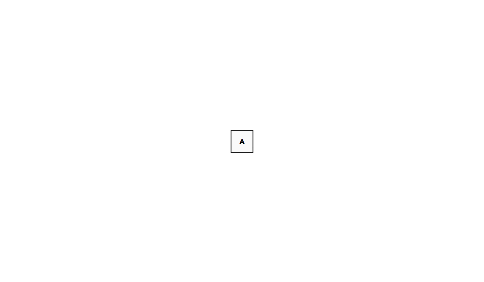

# Animating with React-Spring: Wordle!

This tutorial will cover how to use React Spring to make trailing animations. At the end of this tutorial, you should have successfully built the flipping cards animation of the game Wordle using React Spring!


## Prerequisites

Please ensure that your development environment is setup with the following:

- Node v18.15.0+
- npm v9.5.0+

## Setting up

### Create a basic React App

Open a terminal in a suitable directory/folder in your system and run:

```
npx create-react-app react-spring-wordle
```

This should create a new directory/folder called "react-spring-wordle". Open this directory in the IDE of your choice to continue development!

### Install react-spring

To install react-spring, run the below command in your terminal:

```
npm install react-spring
```

This should install the required package to continue development with react spring

### Run the dev server

To run the dev server to start developing, run:

```
npm start
```

Open http://localhost:3000 in your browser and you should be greeted with a basic react app.

## Building the page to animate

Before we animate something, we need to create the webpage and style it. This section will cover the simple CSS details that aren't too important in this tutorial to learn but are required for the animation to work!

### A simple box


We aim to create a box like this using CSS. For this, we first open `src/App.js` and edit the App() function to create a basic box. The file needs to be modified as:

```
import "./App.css";

function App() {
  return (
    <div className="App">
      <div className="box">
        <div className="front-box">A</div>
      </div>
    </div>
  );
}

export default App;
```

With this, the website previously opened should have changed to just have an "A" at the top left of the page. To make this neat, we now add styles into the `src/App.css`. Add the following css classes into the file:

```
.box {
  position: relative;
  height: 50px;
  width: 50px;
}

.front-box {
  width: 100%;
  height: 100%;
  position: absolute;
  inset: 0;
  display: flex;
  justify-content: center;
  align-items: center;
  font-family: Helvetica, Arial, sans-serif;
  font-weight: 800;
  backface-visibility: hidden;
  background-color: #fafafa;
  border: solid 2px #1a1a1a;
}
```

With this, we should have the simple Wordle box created. Let's position it now!

### How to center a div ~~oh wait this isn't google~~

In this approach to centering a div, I chose to use a flex box. This approach should be whatever the developer prefers for the website. I changed the 'App' classname in `src/App.css` to this:

```
.App {
  width: 100vw;
  height: 100vh;
  display: flex;
  justify-content: center;
  align-items: center;
}
```

With this, you should have something like this:



### 5 Boxes and a container

Wordle is a game played with 5 letters, and we need to animate all 5 letters as a trail. Let's make 5 boxes with an array of letters, and enclose them in a clickable container in this step. For ease of use, let's use "ANVIL" as the word 😏

We declare an array with the 5 letters, and an array map to render each box with the letters, like so:

```
function App() {
  const items = ["A", "N", "V", "I", "L"];
  return (
    <div className="App">
      {items.map((item, index) => (
        <div className="box" key={index}>
          <div className="front-box">{item}</div>
        </div>
      ))}
    </div>
  );
}
```

You should have gotten something like this now:


The gaps aren't quite right and there needs to be a clickable hit box for the rendered boxes. Let's cover it in a div having class name as "container":

```
<div className="App">
    <div className="container">
    {items.map((item, index) => (
        <div className="box" key={index}>
        <div className="front-box">{item}</div>
        </div>
    ))}
    </div>
</div>
```

The class container has the following styles:

```
.container {
  display: flex;
  gap: 10px;
  margin-bottom: 10px;
}
```

Now, we get the neat Wordle design in front of us like this:


### The other side of the box

The box needs to turn green with white text when clicked, and this style is required for the animation. So the class "back-box" is also added into `src/App.css`:

```
.back-box {
  width: 100%;
  height: 100%;
  position: absolute;
  inset: 0;
  display: flex;
  justify-content: center;
  align-items: center;
  font-family: Helvetica, Arial, sans-serif;
  font-weight: 800;
  backface-visibility: hidden;
  background-color: #6cab64;
  border: solid 2px #6cab64;
  color: #fafafa;
}
```

NOTE: For clean styles, there could also be a separate class made for the common style between front and back of the box, but for this tutorial, it's unnecessary!

## Let's animate!

In this section, we animate the components we designed earlier.

### Animated divs

React Spring uses animated components to update elements using the style prop without causing a React render. They are essential to animate with React Spring. More information on them can be found [here](https://www.react-spring.dev/docs/concepts/animated-elements).

To animate the boxes, we need to import "animated" and change the div with class front-box into animated.div like so in `src/App.js`:

```
import "./App.css";
import { animated } from "react-spring";

function App() {
  const items = ["A", "N", "V", "I", "L"];
  return (
    <div className="App">
      <div className="container">
        {items.map((item, index) => (
          <div className="box" key={index}>
            <animated.div className="front-box">{item}</animated.div>
          </div>
        ))}
      </div>
    </div>
  );
}

export default App;
```

### Enter useTrail

useTrail is a React hook in Spring that automatically orchestrates the animations in a list to stagger one after the other. The official documentation describes these animations as "springs" as the library relies on using real spring characteristics to animate realistic animations that look right! More information on this can be found [here](https://www.react-spring.dev/docs/components/use-trail).

We import and use the useTrail hook to obtain the spring information (trail) and access to the spring ref (api), with the following code:

```
const [trail, api] = useTrail(items.length, () => ({
    rotateX: 0,
}));
```

This defines the rotateX to be at 0, which we will use in a bit.

Now, we need to handle a click onto the container to attempt to animate further. For this, we use a simple ref called isFlipped and check the state to push actions onto the Spring ref of the Trail. We add a handleClick arrow function for this:

```
  const isFlipped = useRef(false);

  const handleClick = () => {
    if (isFlipped.current) {
      api.start({
        rotateX: 0,
      });
      isFlipped.current = false;
    } else {
      api.start({
        rotateX: 180,
      });
      isFlipped.current = true;
    }
  };
```

This, we add to "onClick" of the "container" div:

```
<div className="container" onClick={handleClick}>
```

With this, we add a transform to the animated.div of class "front-box" to flip rotateX degrees as per trail. This will require changing the earlier map to use the trail instead of items. The map and it's arrow function will now look like:

````
        {trail.map(({ rotateX }, index) => (
          <div className="box" key={index}>
            <animated.div
              className="front-box"
              style={{
                transform: rotateX.to(
                  (val) => `perspective(600px) rotateX(${val}deg)`
                ),
                transformStyle: "preserve-3d",
              }}
            >
              {items[index]}
            </animated.div>
          </div>
        ))}
        ```
````

Now, the animation will work!! or... wait, why they are flipping into oblivion 😱

If you answered, "hey, we didn't use the back-box!", you have really been paying attention! Let's fix that.

We make another animated.div just like "front-box", with class "back-box" but with transform having 180-rotateX deg, as it has to be rotated on the other side of the front box. The element will look like:

```
            <animated.div
              className="back-box"
              style={{
                transform: rotateX.to(
                  (val) => `perspective(600px) rotateX(${180 - val}deg)`
                ),
                transformStyle: "preserve-3d",
              }}
            >
              {items[index]}
            </animated.div>
```

Now, we should have the animation we hoped for! This is how we use trails in Spring to animate a list to stagger one after the other, it's this simple!

## And Done!

You should now have the behaviour shown in the below GIF:


## Room for growth

This can be further improved by adding more rows, making the rows take input, and matching letters to implement Wordle itself. However, it's not necessary in the scope of this tutorial! This tutorial should serve as a great way to follow and learn how to use a part of react-spring. Hopefully, this is used to implement many more innovative and fun animations 😁
